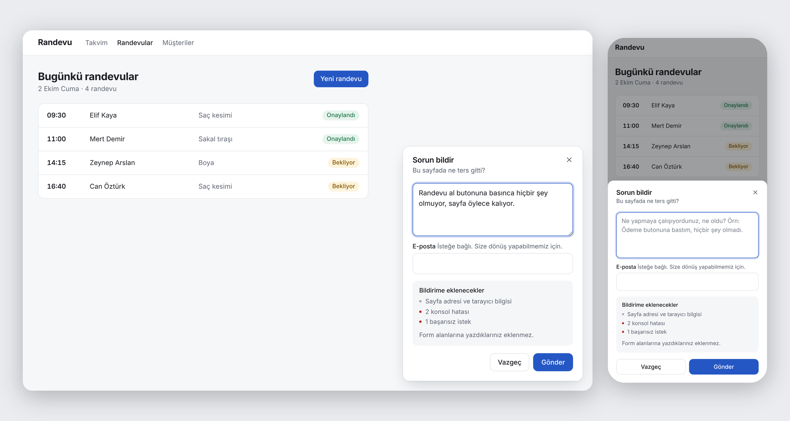
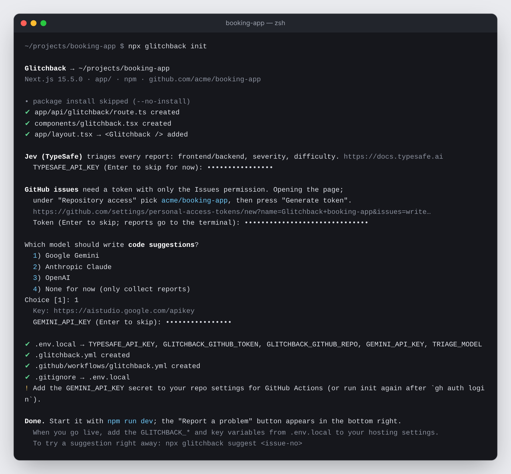
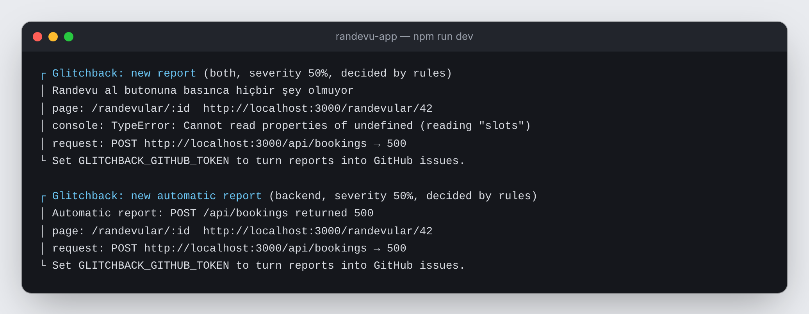
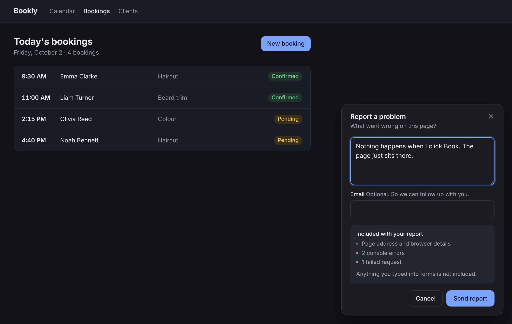
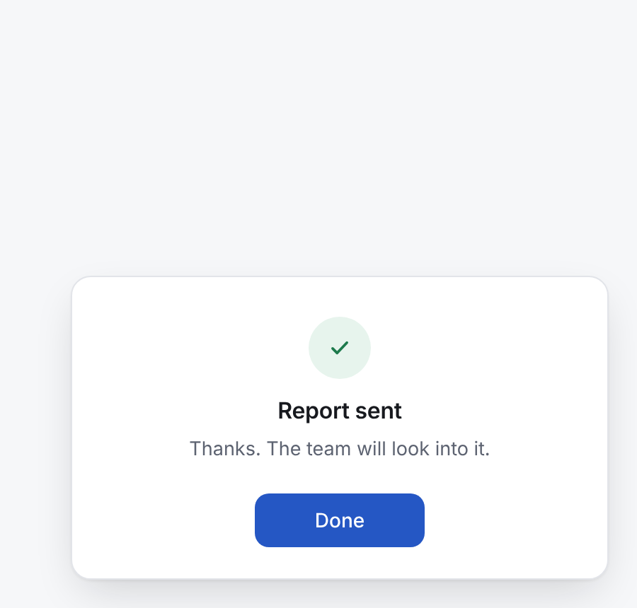

# Glitchback

**English** · [Türkçe](./README_TR.md) · npm: [`glitchback`](https://www.npmjs.com/package/glitchback)

Adds a **"Report a problem"** button to your site. It also reports failed requests (400+) and uncaught JavaScript errors **automatically**, without anyone pressing the button. It collects the user's complaint together with the page address, console errors, failed requests and recent clicks, classifies it with **Jev** (frontend / backend, severity, difficulty) and opens a GitHub issue. For frontend bugs it writes a proposed fix on the issue; when a teammate approves it, it opens a PR.

<p align="center"></p>

No separate database, dashboard or server: reports are received inside your own app, and GitHub becomes the issue tracker.

> **Status:** v0.1, early release. Tests pass (`npm test`). Feedback and issues are welcome.

## Install (Next.js)

```bash
npx glitchback init
```

One command does the following:

- Installs the `glitchback` package.
- Adds `app/api/glitchback/route.ts`; reports are received inside your app (no separate server, CORS or port).
- Adds the `<Glitchback />` button to the root layout.
- Scans your pages and writes `.glitchback.yml`: which page is built from which files, and which files the model must never touch (`api/`, auth, database, `.env`...).
- Adds `.github/workflows/glitchback.yml`.
- Asks a few questions and writes the answers to `.env.local`:
  - **Jev key** (triage)
  - **GitHub token**: opens the token page with the right permission preselected; you only pick the repo
  - **Code model**: Gemini, Claude or OpenAI
- If you are logged in with `gh` on your machine, it also creates the GitHub labels and the Actions secret.

<p align="center"></p>
<p align="center"><sub>While you paste keys and tokens the screen shows only •; the values are written only to <code>.env.local</code>. The CLI speaks your terminal's language (English or Turkish); force one with <code>--lang en</code>.</sub></p>

Then run `npm run dev`; the button appears in the bottom right. It works even without any keys: reports are printed in the dev server's terminal.

<p align="center"></p>

When you go live, add the variables from `.env.local` to your hosting settings as well (on Vercel the repo name is detected automatically).

## How it works

```
User presses "Report a problem"   or   a request returns 400+ / an uncaught error is thrown (automatic)
   │  message + page + console errors + failed requests + recent clicks (never form contents)
   ▼
/api/glitchback  (inside your app)
   │  mask personal data → triage: Jev → fallback model → rules → dedupe
   ▼
GitHub issue   labels: area:frontend|backend|both|unclear · severity:* · tier:low|mid|high
   ├── backend  → optional signed webhook / Slack
   ├── unclear  → a human takes a look
   └── frontend → [suggest] READ-only permission: finds the related files, posts the cause and a diff as a comment
                    │  a teammate adds the `autofix` label
                    ▼
                 [fix] applies the diff the human saw to a branch and opens a PR. Never calls a model.
```

**The suggestion arrives automatically; the decision to touch code always stays with a human.**

## Settings (`.env.local`)

All optional; `init` fills them in.

| Variable | What it does |
|---|---|
| `TYPESAFE_API_KEY` | Triage with **Jev**. Without it, rules are used |
| `GLITCHBACK_GITHUB_TOKEN` | Turns reports into issues. Needs only the **Issues: write** permission. Without it, reports are printed to the terminal |
| `GLITCHBACK_GITHUB_REPO` | `owner/repo`. Detected automatically on Vercel and in GitHub Actions |
| `GEMINI_API_KEY` / `ANTHROPIC_API_KEY` / `OPENAI_API_KEY` / `OPENROUTER_API_KEY` | Code suggestions, and fallback triage when Jev cannot be reached |
| `TRIAGE_MODEL` | Fallback triage model, e.g. `gemini:gemini-3.5-flash` |
| `BACKEND_WEBHOOK_URL` / `BACKEND_WEBHOOK_SECRET` / `SLACK_WEBHOOK_URL` | Notifications for backend reports |
| `GLITCHBACK_ALLOWED_ORIGINS` | Separate server only: the sites allowed to send reports |
| `GLITCHBACK_AUTO_REPORTS` | Set to `off` to turn automatic reports off on the server (on by default) |
| `MAX_GITHUB_WRITES_PER_HOUR` / `MAX_MODEL_TRIAGE_PER_HOUR` | Hourly caps across all clients: new issues + duplicate comments (60) and paid triage calls (300; past it, the rules decide). Cannot be bypassed by spoofing IPs |
| `AUTO_RATE_LIMIT_PER_10_MIN` / `AUTO_MAX_ISSUES_PER_HOUR` | Per-IP limit for automatic reports and the most new issues they can open per hour (10 / 20) |
| `AREA_THRESHOLD` / `INJECTION_THRESHOLD` / `RATE_LIMIT_PER_10_MIN` / `TRUSTED_PROXY_HOPS` | Fine tuning (0.6 / 0.5 / 5 / 1) |

`init` writes `.glitchback.yml`; you can edit its `routes`, `allowed_paths`, `deny_paths` and `models` fields as you like.

## Model providers

Models are always written as `provider:model`; each provider reads only its own key.

| Spec | Key |
|---|---|
| `gemini:gemini-3.5-flash` | `GEMINI_API_KEY` |
| `anthropic:claude-sonnet-5` | `ANTHROPIC_API_KEY` |
| `openai:gpt-6-luna` | `OPENAI_API_KEY` |
| `openrouter:qwen/qwen3-coder` | `OPENROUTER_API_KEY` |
| `ollama:qwen2.5-coder` | none (`OLLAMA_BASE_URL`) |
| no prefix, e.g. `gpt-4o-mini` | `LLM_BASE_URL` (required) + `LLM_API_KEY` (any OpenAI-compatible service) |

- Tiers can use different providers.
- If a model rejects a parameter such as `temperature`, the parameter is dropped and the request is retried once.

## Getting suggestions on your machine

Without waiting for GitHub Actions:

```bash
npx glitchback suggest 12    # posts a suggestion comment on issue 12
npx glitchback fix 12        # applies the approved suggestion to a branch and opens a PR
```

- Your working folder is never touched: the repo is cloned into a temporary folder, the work happens there, and the folder is deleted.
- If you are logged in with `gh`, it runs with that account; keys are read from the app's `.env.local`.

## Sites that are not Next.js

Run a separate report server and add one line to the page:

```bash
GLITCHBACK_ALLOWED_ORIGINS=https://your-site.com npx glitchback serve     # or: docker build -t glitchback .
```

```html
<script src="https://unpkg.com/glitchback/dist/glitchback.global.js"></script>
<script>Glitchback.init({ endpoint: "https://your-report-server.com" })</script>
```

You can also use it in your own Node server: `createHandler(configFromEnv(process.env))` from `glitchback/server` takes a Web `Request` and returns a `Response`. It works directly in Hono, Remix, SvelteKit, Astro, Bun, Deno and similar runtimes.

## Widget options

Passed to the `init({...})` call in `components/glitchback.tsx`:

- `endpoint`: defaults to `/api/glitchback`
- `askContact`: an optional email field. The email is never written to GitHub
- `button: false`: to open the form from your own menu with `Glitchback.open()`
- `locale`: `"auto"` (default), `"tr"` or `"en"`. In auto mode the page's `<html lang>` is checked first, then the browser language; Turkish pages get Turkish, everything else English
- `labels`: to change any text, applied on top of the chosen language. Ready-made sets: `labelsTR`, `labelsEN`
- `theme`: `"auto"` (default; dark theme when the page background is dark), `"light"` or `"dark"`
- `position`: `"right"` (default) or `"left"`
- `getRoute`: a page pattern such as `"/products/:id"`. Without it, ids in the path are turned into a pattern automatically
- `appVersion`
- `autoReport`: on by default. `false` turns it off; an object tunes it (below)

Language and theme are picked from the page: in English, on a page with a dark background, and after sending:

<p align="center">
  
  
</p>

### Automatic reports

Even when the user writes nothing, the widget sends a report by itself when:

- A `fetch` / `XMLHttpRequest` request returns **400 or above**. 401, 403, 404 and 429 are usually expected, so they are skipped by default. Requests that get no response at all (while the user is online) are reported too. Requests the app cancels itself do not count.
- An **uncaught error** or an unhandled promise rejection happens. `console.error` calls alone are not reported; they are only added as context.

The report goes out with the page, console errors, failed requests and recent clicks. It is triaged and becomes an issue with the `glitchback:auto` label. If it turns out to be frontend, the suggestion still arrives automatically; the `autofix` label opens a PR.

Against noise:

- The same failure (same endpoint + same status code, or the same error message on the same page) is sent once per browser session. At most 5 automatic reports are sent per page.
- The server groups the same failure into **one issue**. Repeats from other visitors do not go to triage or GitHub, and add no comments.
- Automatic reports have their own rate limit; a noisy page never blocks a report the user typed.

```ts
init({
  autoReport: {
    statuses: [400, 422, 500, 502, 503], // or (s) => s >= 500
    errors: true,       // uncaught errors
    requests: true,     // failed requests
    maxPerPage: 5,
    delayMs: 1500,      // short wait so the errors that follow are included
  },
});
```

The widget uses your site's font. Colors change through CSS variables: `--glitchback-accent`, `--glitchback-on-accent`, `--glitchback-bg`, `--glitchback-fg`, `--glitchback-border`, `--glitchback-muted`, `--glitchback-subtle`, `--glitchback-radius`.

## Security

1. **User text is never treated as instructions, at any stage.** Triage separately scores whether the text contains instructions aimed at an AI. Suspicious reports get the `glitchback:needs-review` label and no automatic suggestion is made.
2. **The suggestion step has read-only permission.** Writing code starts only when a teammate adds the `autofix` label.
3. **The diff that is applied is the diff a human saw.** It is read only from the bot account's comment. The write step never calls a model. The model's explanations are escaped; it cannot add a hidden suggestion block.
4. **File path gate:** the model works only under `allowed_paths`. `deny_paths` (API, auth, database, `.env` variants, CI, lockfiles) are always off limits. Paths are checked both before and after applying.
5. **Nothing is ever merged automatically.**
6. **Personal data is masked:** emails, phone numbers, card numbers, Turkish national IDs, tokens, sensitive URL parameters, everything after `#` in a URL, and tokens in paths (`/reset-password/<token>`). The widget never reads form fields.
7. **Automatic reports contain no user text.** The message is generated by the widget. URLs and error messages go through the same masking.
8. **Same origin:** requests from browsers are accepted only from your own site. The endpoint is public; reports sent from outside a browser (e.g. curl) can arrive too. Against those there is a per-IP limit, hourly GitHub and model budgets across all clients, and a 256 KB body limit. On Vercel the client address is read from the platform's `x-real-ip` header; on your own server with no proxy in front, set `TRUSTED_PROXY_HOPS=0`.
9. **Prompt injection screening covers every field of the report** (message, console errors, URLs, clicks). Without Jev or a fallback model only the rules screen it; in that case suggestions do not start on their own and need the `glitchback:suggest` label or `npx glitchback suggest`.
10. **`autofix` only works for people with write access.** The applied diff must have been written for the same issue and must be exactly the diff shown in the comment. Diffs containing invisible or bidirectional control characters are never suggested or applied.
11. **Webhook signatures are timestamped:** `X-Glitchback-Timestamp` and `HMAC(secret, timestamp + "." + body)`. Reject requests older than 5 minutes (`examples/webhook-receiver`).
12. **The workflow is pinned to the Glitchback version that wrote it** (`npx -y glitchback@<version>`); upgrading is a reviewed change to that file.

## Development

```bash
npm install
npm test            # 70 tests, no network needed
npm run typecheck
npm run build       # packages/glitchback/dist
node packages/glitchback/dist/cli.js init ../some-next-project
```

A single package: `widget/`, `server/`, `fixer/`, `schema/`, `cli/` and the Next.js entry `next.ts` under `packages/glitchback/src`.

### Installing from a local checkout

To try unreleased changes, run `npm install && npm run build` in the Glitchback folder, then in your app folder:

```bash
node ../glitchback/packages/glitchback/dist/cli.js init
```

`init` notices it is running from a local copy and installs the package from there.

## Known limitations

- One-command install exists only for the Next.js App Router for now; everything else works with `serve`.
- Rate limits live in memory. On serverless, each instance counts separately.
- Deduplication uses GitHub search; the same report arriving within seconds on a different server instance can open a second issue.

## License

MIT
