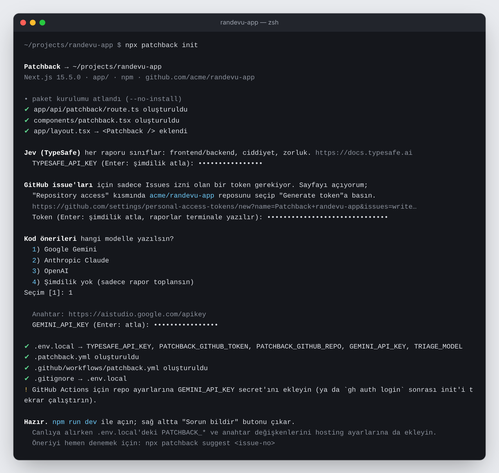
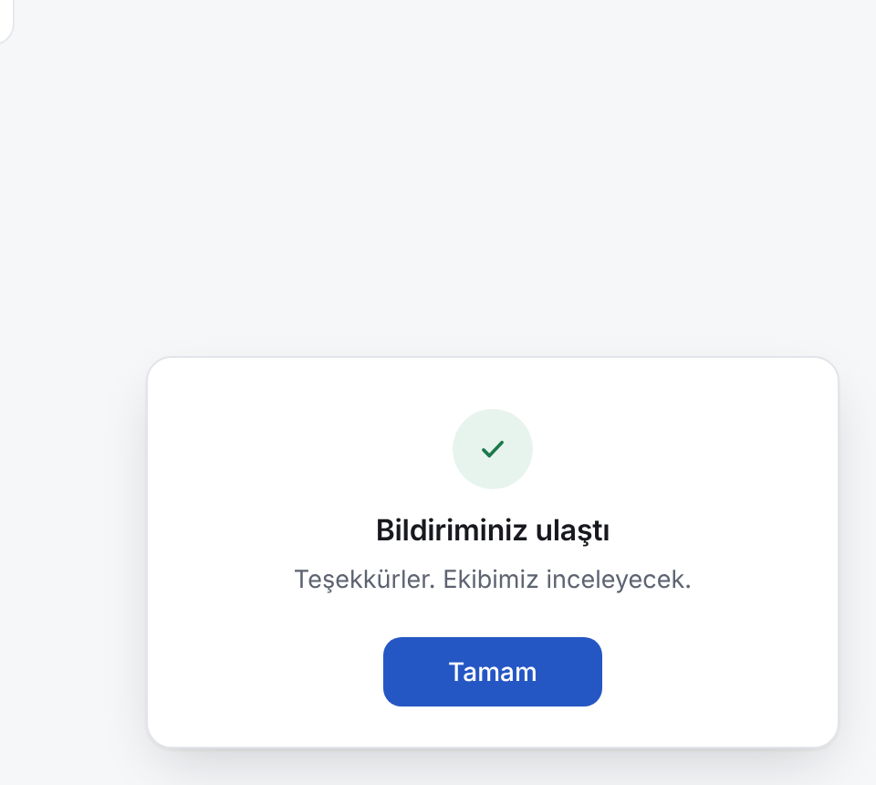

# Patchback

Sitenize bir **"Sorun bildir"** butonu ekler. Başarısız istekleri (400+) ve yakalanmamış JavaScript hatalarını da kimse butona basmadan **otomatik** rapor eder. Kullanıcının yazdığı şikâyeti sayfa adresi, konsol hataları, başarısız istekler ve son tıklamalarla birlikte toplar, **Jev** ile sınıflandırır (frontend / backend, ciddiyet, zorluk) ve GitHub issue'su açar. Frontend hataları için düzeltme önerisini issue'ya yazar; ekipten biri onaylarsa PR açar.

<p align="center"></p>

Ayrı veritabanı, panel ya da sunucu yok: raporlar uygulamanızın kendi içinde karşılanır, GitHub da iş takibi olur.

> **Durum:** v0.1. Testler geçiyor (`npm test`). Paket henüz npm'de yayımlanmadı; o zamana kadar [yerelden kurulum](#yayımlanmadan-önce-yerelden-kurmak) kullanılır.

## Kurulum (Next.js)

```bash
npx patchback init
```

Tek komut şunları yapar:

- `patchback` paketini kurar.
- `app/api/patchback/route.ts` ekler; raporlar uygulamanızın içinde karşılanır (ayrı sunucu, CORS, port yok).
- Kök layout'a `<Patchback />` butonunu ekler.
- Sayfalarınızı tarayıp `.patchback.yml` yazar: hangi sayfanın hangi dosyalardan oluştuğu, modelin dokunamayacağı dosyalar (`api/`, auth, veritabanı, `.env`...).
- `.github/workflows/patchback.yml` ekler.
- Birkaç şey sorar ve `.env.local`'e yazar:
  - **Jev anahtarı** (triyaj)
  - **GitHub token'ı**: token sayfasını doğru izinle hazır açar, siz sadece repoyu seçersiniz
  - **Kod modeli**: Gemini, Claude ya da OpenAI
- Bilgisayarınızda `gh` ile giriş yapılmışsa GitHub etiketlerini ve Actions secret'ını da kendisi oluşturur.

<p align="center"></p>
<p align="center"><sub>Anahtar ve token'lar yazılırken ekranda yalnızca • görünür; değerler sadece <code>.env.local</code>'e yazılır.</sub></p>

Sonra `npm run dev` çalıştırın; sağ altta buton çıkar. Hiçbir anahtar girmeseniz bile çalışır: raporlar geliştirme sunucusunun terminaline yazılır.

<p align="center"></p>

Canlıya alırken `.env.local`'deki değişkenleri hosting ayarlarına da ekleyin (Vercel'de repo adı otomatik bulunur).

## Nasıl çalışır

```
Kullanıcı "Sorun bildir"e basar   ya da   bir istek 400+ döner / yakalanmamış hata olur (otomatik)
   │  mesaj + sayfa + konsol hataları + başarısız istekler + son tıklamalar (form içerikleri asla)
   ▼
/api/patchback  (uygulamanızın içinde)
   │  kişisel veriyi maskele → triyaj: Jev → yedek model → kurallar → tekilleştir
   ▼
GitHub issue   etiketler: area:frontend|backend|both|unclear · severity:* · tier:low|mid|high
   ├── backend  → isteğe bağlı imzalı webhook / Slack
   ├── unclear  → bir insan bakar
   └── frontend → [suggest] yalnızca OKUMA izni: ilgili dosyaları bulur, nedeni ve diff'i yorum olarak yazar
                    │  ekipten biri `autofix` etiketini ekler
                    ▼
                 [fix] insanın gördüğü diff'i branch'e uygular, PR açar. Model çağırmaz.
```

**Öneri otomatik gelir, koda dokunma kararı hep bir insanda kalır.**

## Ayarlar (`.env.local`)

Hepsi isteğe bağlı; `init` doldurur.

| Değişken | Ne işe yarar |
|---|---|
| `TYPESAFE_API_KEY` | **Jev** ile triyaj. Yoksa kurallar kullanılır |
| `PATCHBACK_GITHUB_TOKEN` | Raporları issue yapar. Sadece **Issues: write** izni. Yoksa raporlar terminale yazılır |
| `PATCHBACK_GITHUB_REPO` | `sahip/repo`. Vercel ve GitHub Actions'ta otomatik bulunur |
| `GEMINI_API_KEY` / `ANTHROPIC_API_KEY` / `OPENAI_API_KEY` / `OPENROUTER_API_KEY` | Kod önerileri ve Jev'e ulaşılamazsa yedek triyaj |
| `TRIAGE_MODEL` | Yedek triyaj modeli, örn. `gemini:gemini-3.5-flash` |
| `BACKEND_WEBHOOK_URL` / `BACKEND_WEBHOOK_SECRET` / `SLACK_WEBHOOK_URL` | Backend raporları için bildirim |
| `PATCHBACK_ALLOWED_ORIGINS` | Yalnızca ayrı sunucuda: rapor gönderebilecek siteler |
| `PATCHBACK_AUTO_REPORTS` | `off` yazarsanız otomatik raporlar sunucuda kapanır (varsayılan açık) |
| `MAX_GITHUB_WRITES_PER_HOUR` / `MAX_MODEL_TRIAGE_PER_HOUR` | Tüm istemciler için saatlik üst sınır: yeni issue + tekrar yorumu (60) ve ücretli triyaj çağrısı (300; aşılınca kurallar karar verir). IP taklit edilse bile aşılamaz |
| `AUTO_RATE_LIMIT_PER_10_MIN` / `AUTO_MAX_ISSUES_PER_HOUR` | Otomatik raporlar için IP başına sınır ve saatte açılabilecek en fazla yeni issue (10 / 20) |
| `AREA_THRESHOLD` / `INJECTION_THRESHOLD` / `RATE_LIMIT_PER_10_MIN` / `TRUSTED_PROXY_HOPS` | İnce ayar (0.6 / 0.5 / 5 / 1) |

`.patchback.yml`'ı `init` yazar; `routes`, `allowed_paths`, `deny_paths` ve `models` alanlarını istediğiniz gibi düzenleyebilirsiniz.

## Model sağlayıcıları

Model her yerde `sağlayıcı:model` diye yazılır; her sağlayıcı yalnızca kendi anahtarını okur.

| Yazım | Anahtar |
|---|---|
| `gemini:gemini-3.5-flash` | `GEMINI_API_KEY` |
| `anthropic:claude-sonnet-5` | `ANTHROPIC_API_KEY` |
| `openai:gpt-6-luna` | `OPENAI_API_KEY` |
| `openrouter:qwen/qwen3-coder` | `OPENROUTER_API_KEY` |
| `ollama:qwen2.5-coder` | yok (`OLLAMA_BASE_URL`) |
| önek yok, örn. `gpt-4o-mini` | `LLM_BASE_URL` (zorunlu) + `LLM_API_KEY` (OpenAI uyumlu her servis) |

- Kademeler farklı sağlayıcılardan olabilir.
- Bir model `temperature` gibi bir parametreyi reddederse o parametre çıkarılıp istek bir kez daha denenir.

## Önerileri bilgisayarınızda almak

GitHub Actions'ı beklemeden:

```bash
npx patchback suggest 12    # 12 numaralı issue'ya öneri yorumu yazar
npx patchback fix 12        # onaylanan öneriyi branch'e uygulayıp PR açar
```

- Çalışma klasörünüze dokunmaz: repoyu geçici bir klasöre klonlar, orada çalışır ve siler.
- `gh` ile giriş yaptıysanız o yetkiyle çalışır; anahtarları uygulamanın `.env.local`'inden okur.

## Next.js olmayan siteler

Ayrı bir rapor sunucusu açın ve sayfaya tek satır ekleyin:

```bash
PATCHBACK_ALLOWED_ORIGINS=https://siteniz.com npx patchback serve     # ya da: docker build -t patchback .
```

```html
<script src="https://unpkg.com/patchback/dist/patchback.global.js"></script>
<script>Patchback.init({ endpoint: "https://rapor-sunucunuz.com" })</script>
```

Kendi Node sunucunuzda da kullanabilirsiniz: `patchback/server` içindeki `createHandler(configFromEnv(process.env))`, Web `Request` alıp `Response` döndürür. Hono, Remix, SvelteKit, Astro, Bun, Deno gibi ortamlarda doğrudan çalışır.

## Widget seçenekleri

`components/patchback.tsx` içindeki `init({...})` çağrısına verilir:

- `endpoint`: varsayılan `/api/patchback`
- `askContact`: isteğe bağlı e-posta alanı. E-posta GitHub'a asla yazılmaz
- `button: false`: kendi menünüzden `Patchback.open()` ile açmak için
- `locale`: `"auto"` (varsayılan), `"tr"` ya da `"en"`. Otomatikte önce sayfanın `<html lang>` değerine, sonra tarayıcı diline bakılır; Türkçe sayfalar Türkçe, diğerleri İngilizce görür
- `labels`: metinleri değiştirmek için, seçilen dilin üstüne uygulanır. Hazır setler: `labelsTR`, `labelsEN`
- `theme`: `"auto"` (varsayılan; sayfanın arka planı koyuysa koyu tema), `"light"` ya da `"dark"`
- `position`: `"right"` (varsayılan) ya da `"left"`
- `getRoute`: `"/products/:id"` gibi sayfa kalıbı. Verilmezse yoldaki kimlikler otomatik kalıba çevrilir
- `appVersion`
- `autoReport`: varsayılan açık. `false` kapatır; nesne verirseniz ayarlar (aşağıda)

Dil ve tema sayfadan otomatik seçilir: İngilizce, koyu arka planlı bir sayfada ve gönderim sonrası:

<p align="center">
  
  
</p>

### Otomatik raporlar

Kullanıcı hiçbir şey yazmasa da widget şu durumlarda kendisi rapor gönderir:

- Bir `fetch` / `XMLHttpRequest` isteği **400 ve üstü** döner. 401, 403, 404 ve 429 genelde beklenen durumlar olduğu için varsayılan olarak atlanır. Hiç cevap gelmeyen istekler (kullanıcı çevrimiçiyken) de rapor edilir. Uygulamanın kendi iptal ettiği istekler sayılmaz.
- **Yakalanmamış bir hata** ya da karşılanmamış bir promise reddi olur. `console.error` çağrıları tek başına rapor sayılmaz, sadece bağlama eklenir.

Rapor, sayfa, konsol hataları, başarısız istekler ve son tıklamalarla birlikte gider. Triyajdan geçer ve `patchback:auto` etiketiyle issue olur. Frontend çıkarsa öneri yine otomatik gelir; `autofix` etiketiyle PR açılır.

Gürültüye karşı:

- Aynı hata (aynı uç nokta + aynı durum kodu, ya da aynı sayfada aynı hata mesajı) tarayıcı oturumu başına bir kez gönderilir. Sayfa başına en fazla 5 otomatik rapor gider.
- Sunucu aynı hatayı **tek issue**'da toplar. Farklı ziyaretçilerden gelen tekrarlar triyaja ve GitHub'a gitmez, yorum da eklenmez.
- Otomatik raporların istek sınırı ayrıdır; gürültülü bir sayfa, kullanıcının elle yazdığı raporu engellemez.

```ts
init({
  autoReport: {
    statuses: [400, 422, 500, 502, 503], // ya da (s) => s >= 500
    errors: true,       // yakalanmamış hatalar
    requests: true,     // başarısız istekler
    maxPerPage: 5,
    delayMs: 1500,      // takip eden hatalar da rapora girsin diye kısa bekleme
  },
});
```

Widget, sitenizin yazı tipini kullanır. Renkler CSS değişkenleriyle değişir: `--patchback-accent`, `--patchback-on-accent`, `--patchback-bg`, `--patchback-fg`, `--patchback-border`, `--patchback-muted`, `--patchback-subtle`, `--patchback-radius`.

## Güvenlik

1. **Kullanıcı metni hiçbir aşamada talimat sayılmaz.** Triyaj, metinde yapay zekâya yönelik talimat olup olmadığını ayrıca puanlar. Şüpheli raporlar `patchback:needs-review` etiketi alır ve otomatik öneri üretilmez.
2. **Öneri adımı yalnızca okuma iznine sahiptir.** Koda yazma, bir ekip üyesinin `autofix` etiketini eklemesiyle başlar.
3. **Uygulanan diff, insanın gördüğü diff'in aynısıdır.** Yalnızca bot hesabının yorumundan okunur. Yazma adımı modeli hiç çağırmaz. Modelin açıklamaları escape edilir; gizli bir öneri bloğu ekleyemez.
4. **Dosya yolu kapısı:** model yalnızca `allowed_paths` altında çalışır. `deny_paths` (API, auth, veritabanı, `.env` türevleri, CI, lockfile) her durumda kapalıdır. Yollar uygulamadan önce ve sonra kontrol edilir.
5. **Hiçbir şey otomatik merge edilmez.**
6. **Kişisel veri maskelenir:** e-posta, telefon, kart, TC kimlik, token'lar, URL'deki hassas parametreler, URL'nin `#` sonrası ve yoldaki token'lar (`/reset-password/<token>`). Widget form alanlarını okumaz.
7. **Otomatik raporlarda kullanıcı metni yoktur.** Mesaj widget tarafından üretilir. URL'ler ve hata mesajları da aynı maskelemeden geçer.
8. **Aynı origin:** tarayıcıdan gelen istekler yalnızca kendi sitenizden kabul edilir. Uç nokta herkese açıktır; tarayıcı dışından (curl gibi) gönderilen raporlar da gelebilir. Bunlara karşı IP başına sınır, tüm istemciler için saatlik GitHub ve model bütçesi ve 256 KB gövde sınırı vardır. Vercel'de istemci adresi platformun `x-real-ip` başlığından okunur; kendi sunucunuzda, önünde proxy yoksa `TRUSTED_PROXY_HOPS=0` yapın.
9. **Prompt injection taraması raporun tüm alanlarına bakar** (mesaj, konsol hataları, URL'ler, tıklamalar). Jev ya da yedek model yoksa yalnızca kurallar tarar; bu durumda öneri kendiliğinden başlamaz, `patchback:suggest` etiketi ya da `npx patchback suggest` gerekir.
10. **`autofix` yalnızca yazma yetkisi olanlarda çalışır.** Uygulanan diff, aynı issue için yazılmış ve yorumda görünen diff'le birebir aynı olmak zorundadır. Görünmez ya da yön değiştiren karakter içeren diff'ler önerilmez ve uygulanmaz.
11. **Webhook imzası zaman damgalıdır:** `X-Patchback-Timestamp` ve `HMAC(secret, timestamp + "." + gövde)`. 5 dakikadan eski istekleri reddedin (`examples/webhook-receiver`).
12. **Workflow, onu yazan Patchback sürümüne sabitlenir** (`npx -y patchback@<sürüm>`); yükseltme bu dosyada gözden geçirilen bir değişikliktir.

## Geliştirme

```bash
npm install
npm test            # 57 test, ağ gerektirmez
npm run typecheck
npm run build       # packages/patchback/dist
node packages/patchback/dist/cli.js init ../bir-next-projesi
```

Tek paket: `packages/patchback/src` altında `widget/`, `server/`, `fixer/`, `schema/`, `cli/` ve Next.js girişi `next.ts`.

### Yayımlanmadan önce yerelden kurmak

Patchback klasöründe `npm install && npm run build` çalıştırın, sonra uygulama klasöründe:

```bash
node ../patchback/packages/patchback/dist/cli.js init
```

`init` kendini yerel kopyadan çalıştığını anlar ve paketi oradan kurar.

## Bilinen sınırlamalar

- Şimdilik yalnızca Next.js App Router için tek komutla kurulum var; diğerleri `serve` ile çalışır.
- İstek sınırı bellek içindedir. Serverless ortamda her kopya ayrı sayar.
- Tekilleştirme GitHub aramasını kullanır; saniyeler içinde gelen aynı rapor ikinci issue açabilir.
- GitHub Actions adımları paket npm'e yayımlanınca çalışır (`npx patchback@0`).

## Yol haritası

- [ ] npm'e yayımlama
- [ ] GitHub App: token oluşturmadan tek tıkla kurulum
- [ ] Vite / Remix / SvelteKit için `init`
- [ ] CI başarısız olunca bir üst modelle yeniden deneme
- [ ] Ekran görüntüsü (isteğe bağlı, maskelemeli)

## Lisans

MIT
